# Whats?
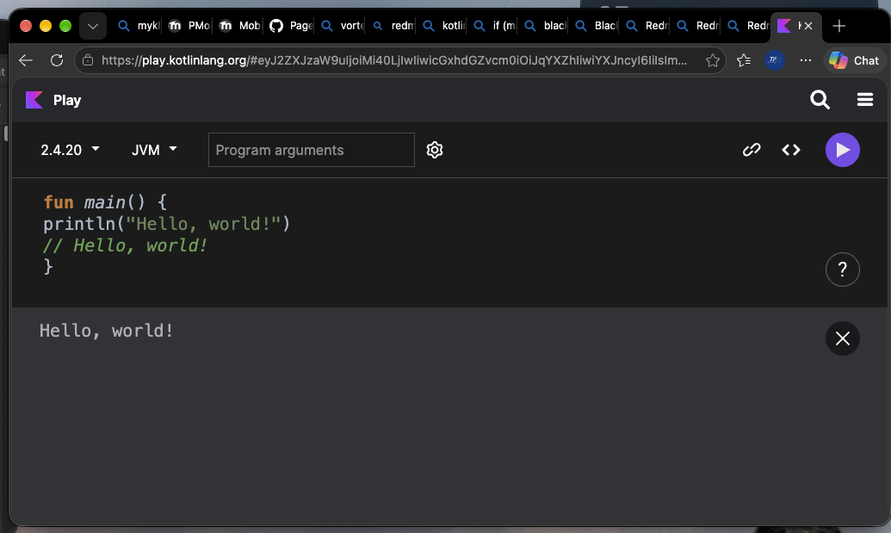

# String Templates
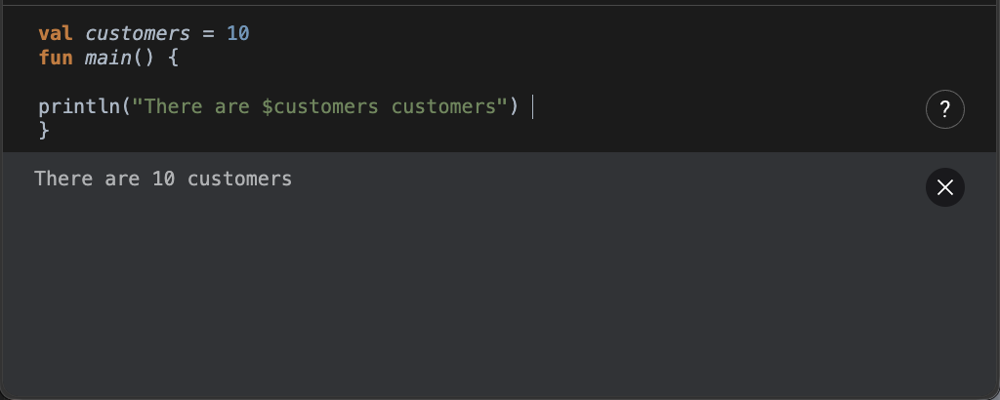

# Tipe Data Dasar
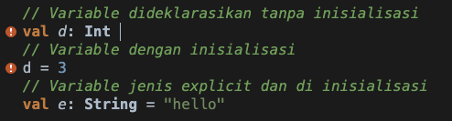

# List
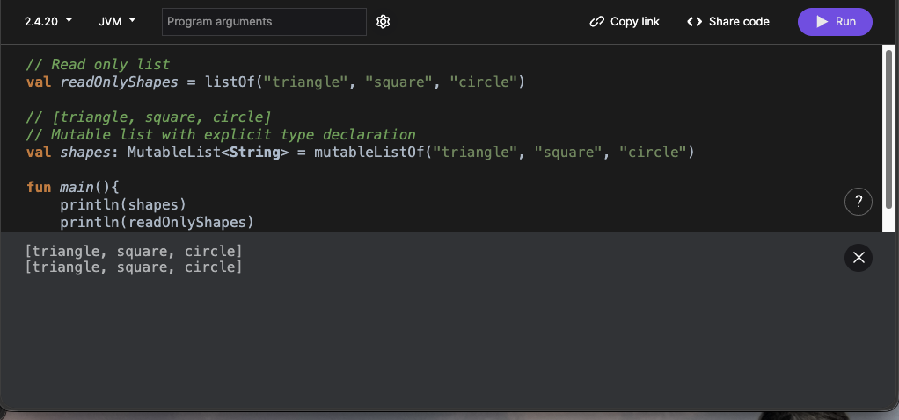

# sets
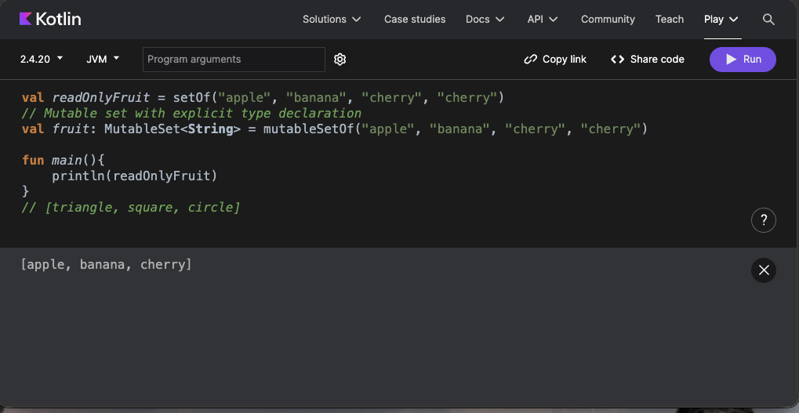

# map
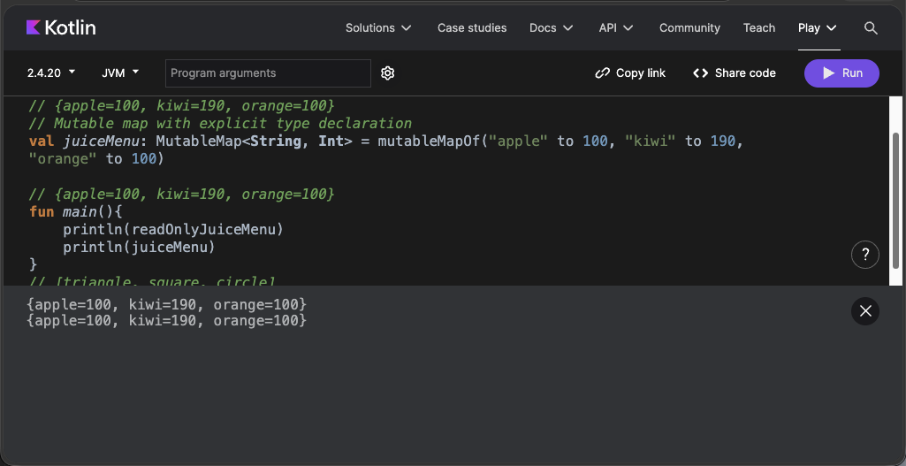

# if
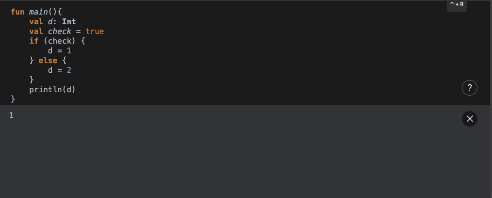
# when
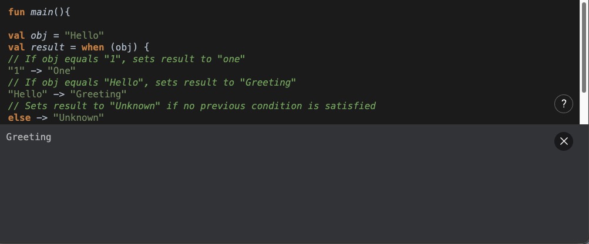

# for
! [9.png](./9.png)

# function
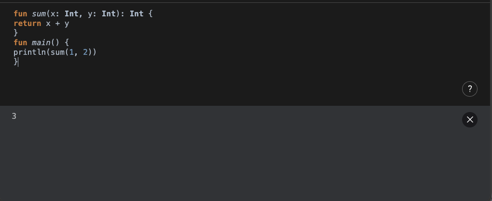

# Named Args
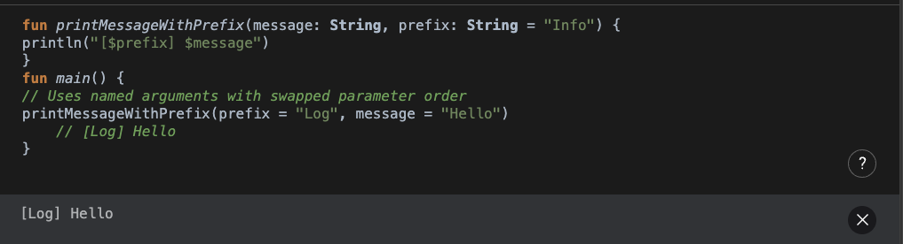

# Default Parameters Values
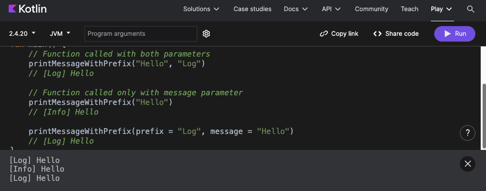

# function without return
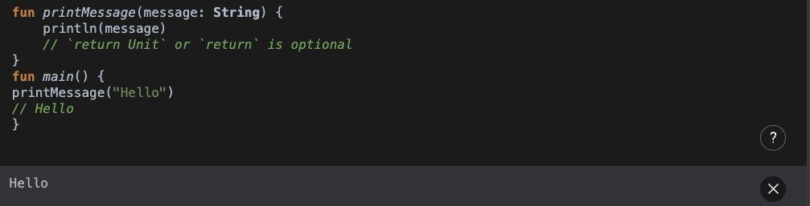

# Lambda Expression
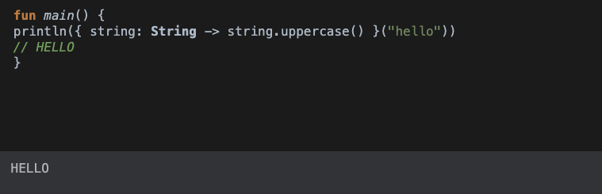

# Access Properties
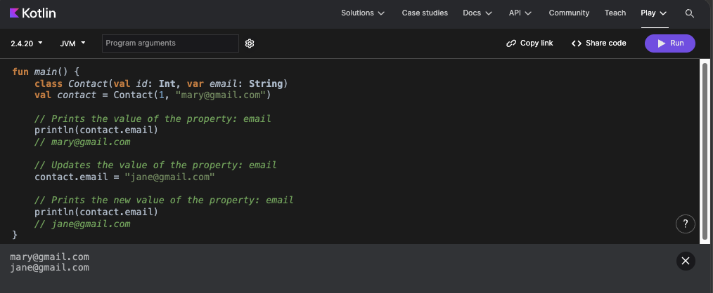

# Compare Instance
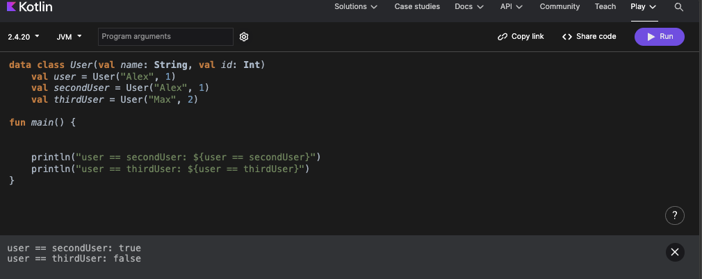

# Copy Instance
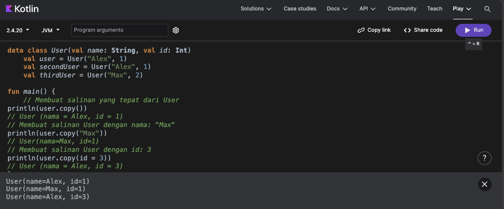

# Nullable Types
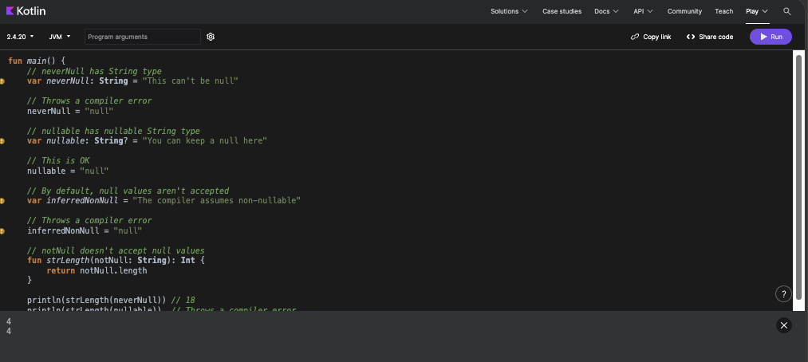

# Check for null values
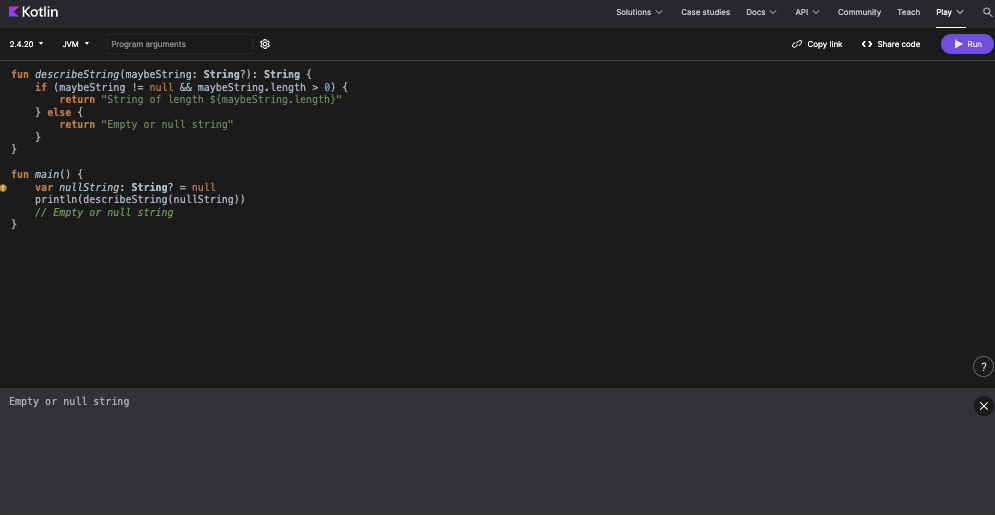

# use the safe call operator
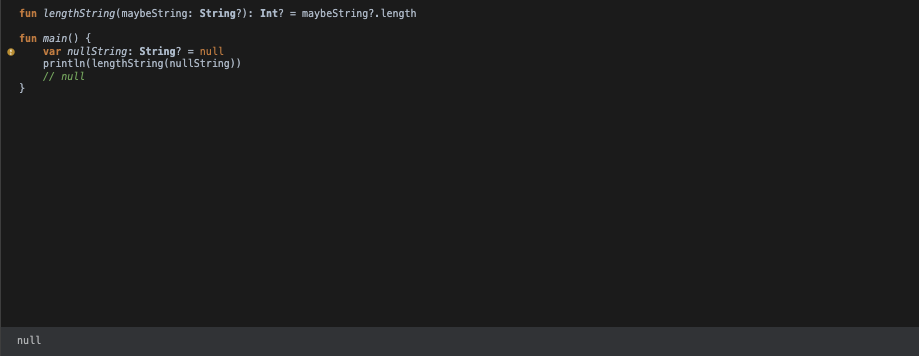
